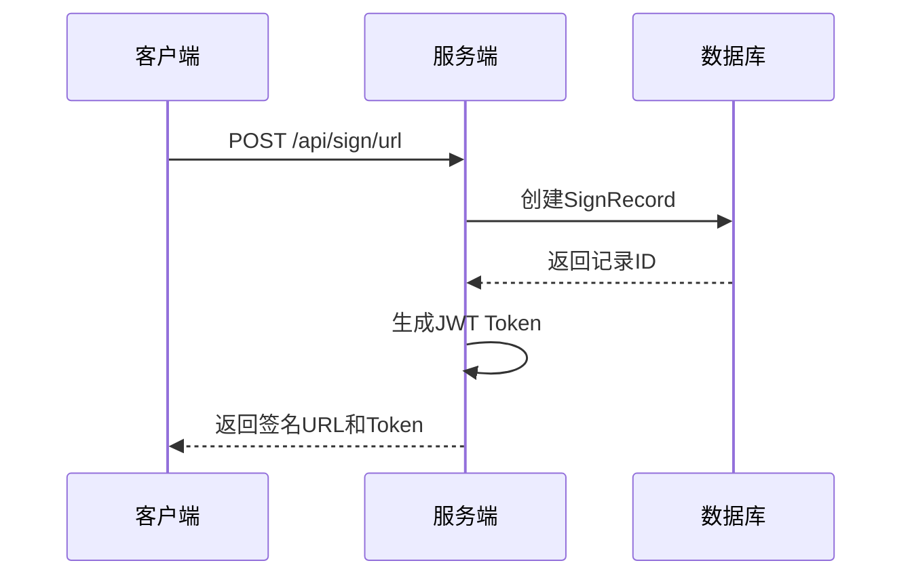
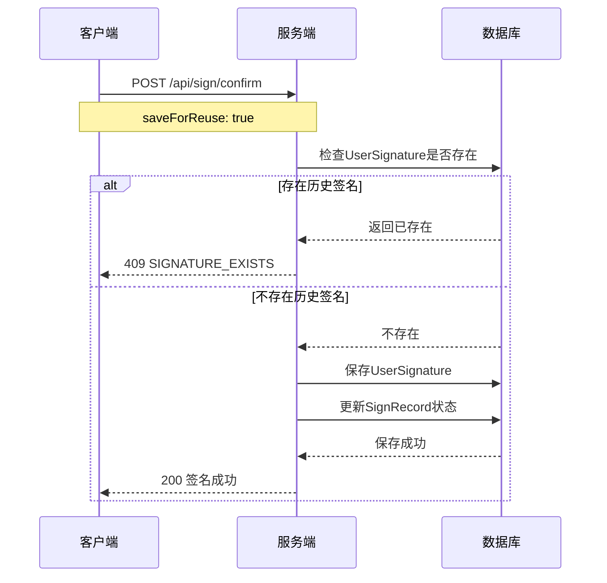

# QR签名系统 API文档

## 📋 概述

本文档描述了QR签名系统的完整API接口，包括现有的核心接口和新增的签名冲突检查接口。

## 🔗 基础信息

- **Base URL**: `http://localhost:29308`
- **API版本**: v1
- **认证方式**: JWT Bearer Token
- **数据格式**: JSON

## 📊 API端点

### 1. 生成签署URL

**POST** `/api/sign/url`

生成签署URL和二维码，支持多次签名。

#### 请求参数
```json
{
  "projectId": "project-001",
  "userId": "user-001",
  "fileId": "file-001",
  "metaCode": "META-CODE-001"
}
```

#### 响应示例
```json
{
  "signUrl": "http://localhost:29308/signature.html?token=Bearer xxx",
  "token": "Bearer xxx",
  "status": "未扫描",
  "signatureSequence": 1,
  "signRecordId": "uuid-string"
}
```

### 2. 验证Token

**GET** `/api/sign/{token}`

验证JWT token的有效性。

#### 响应示例
```json
{
  "valid": true,
  "message": "Token有效"
}
```

### 3. 查询签名状态

**GET** `/api/sign/status?signRecordId={signRecordId}`

查询指定签名记录的状态。

#### 响应示例
```json
{
  "signRecordId": "uuid-string",
  "status": "已签署",
  "signatureBase64": "data:image/png;base64,xxx"
}
```

### 4. 确认签名

**POST** `/api/sign/confirm`

确认签名并可选择保存供下次使用。

#### 请求参数
```json
{
  "signatureBase64": "data:image/png;base64,xxx",
  "saveForReuse": true,
  "userSignatureId": "optional-signature-id"
}
```

#### 成功响应
```json
{
  "message": "签署成功",
  "status": "已签署",
  "signatureBase64": "data:image/png;base64,xxx",
  "signRecordId": "uuid-string",
  "signatureSequence": 1
}
```

#### 错误响应 - 签名冲突
```json
{
  "code": "SIGNATURE_EXISTS",
  "message": "该用户已存在历史签名，不可重复保存",
  "timestamp": "2024-01-01T12:00:00"
}
```

### 5. 检查签名保存权限 (NEW)

**GET** `/api/sign/check-signature-exists?userId={userId}`

检查用户是否可以保存签名（即是否已存在历史签名）。

#### 请求参数
- `userId`: 用户ID (必需)

#### 响应示例 - 可以保存
```json
{
  "canSave": true,
  "message": "可以保存",
  "userId": "user-001",
  "hasExistingSignature": false
}
```

#### 响应示例 - 不可保存
```json
{
  "canSave": false,
  "message": "该用户已存在历史签名，不可重复保存",
  "userId": "user-001",
  "hasExistingSignature": true,
  "existingSignatureId": "signature-uuid"
}
```

### 6. 获取用户历史签名

**GET** `/api/sign/user-signatures?userId={userId}`

获取指定用户的所有历史签名。

#### 响应示例
```json
{
  "userId": "user-001",
  "signatures": [
    {
      "id": "signature-uuid-1",
      "signatureBase64": "data:image/png;base64,xxx",
      "createdAt": "2024-01-01T10:00:00",
      "updatedAt": "2024-01-01T10:00:00"
    }
  ]
}
```

## 🚫 错误码

| 错误码 | 描述 | HTTP状态码 |
|--------|------|------------|
| SIGNATURE_EXISTS | 用户已存在历史签名 | 409 Conflict |
| INVALID_TOKEN | 无效的Token | 401 Unauthorized |
| TOKEN_EXPIRED | Token已过期 | 401 Unauthorized |
| RECORD_NOT_FOUND | 签名记录不存在 | 404 Not Found |
| SIGNATURE_ALREADY_COMPLETED | 签名已完成 | 400 Bad Request |
| VALIDATION_ERROR | 请求参数验证失败 | 400 Bad Request |

## 🔐 认证

### JWT Token结构
```json
{
  "sub": "user-001",
  "projectId": "project-001",
  "fileId": "file-001",
  "metaCode": "META-CODE-001",
  "iat": 1640995200,
  "exp": 1641002400
}
```

### 请求头格式
```
Authorization: Bearer <jwt-token>
```

## 🔄 工作流程

### 1. 生成签名流程


### 2. 签名确认流程 (带冲突检查)


## 📝 使用示例

### 检查签名保存权限
```bash
curl -X GET "http://localhost:29308/api/sign/check-signature-exists?userId=user-001" \
  -H "Accept: application/json"
```

### 确认签名 (首次保存)
```bash
curl -X POST "http://localhost:29308/api/sign/confirm" \
  -H "Content-Type: application/json" \
  -H "Authorization: Bearer your-jwt-token" \
  -d '{
    "signatureBase64": "data:image/png;base64,xxx",
    "saveForReuse": true
  }'
```

### 确认签名 (使用历史签名)
```bash
curl -X POST "http://localhost:29308/api/sign/confirm" \
  -H "Content-Type: application/json" \
  -H "Authorization: Bearer your-jwt-token" \
  -d '{
    "userSignatureId": "signature-uuid",
    "saveForReuse": false
  }'
```

## 🔧 技术细节

### 数据库约束
- `user_signatures.user_id` 有唯一索引约束
- 每个用户只能保存一个签名供重用

### 缓存机制
- Token缓存：15分钟TTL
- 状态查询缓存：5分钟TTL

### 安全考虑
- JWT Token包含过期时间
- 签名数据Base64编码存储
- 所有API请求需要认证

## 📊 状态枚举

### 签署状态
- `UNSCANNED` - 未扫描
- `SCANNED_UNCONFIRMED` - 已扫描未签署
- `SIGNED` - 已签署

## 🛠️ 技术栈

### 后端技术
- **框架**: Spring Boot 3.2.0
- **数据库**: SQLite
- **缓存**: Redis
- **认证**: JWT
- **Java版本**: 17+

### 部署环境
- **端口**: 29308
- **主机**: localhost
- **Redis**: 10.219.24.10:6379

## 🚀 部署说明

### 环境要求
- Java 17+
- Redis服务器
- SQLite数据库（自动创建）

### 启动命令
```bash
mvn spring-boot:run
```

### 访问地址
- 主页: http://localhost:29308
- API测试: 使用上述curl命令

## 🔄 版本信息

- **版本**: 1.0.0
- **最后更新**: 2024年
- **Spring Boot**: 3.2.0
- **Java**: 17+

---

## 📞 技术支持

如有问题请查看：
- 项目源码中的CLAUDE.md文件
- 实施计划文档IMPLEMENTATION_PLAN.md
- 应用日志输出