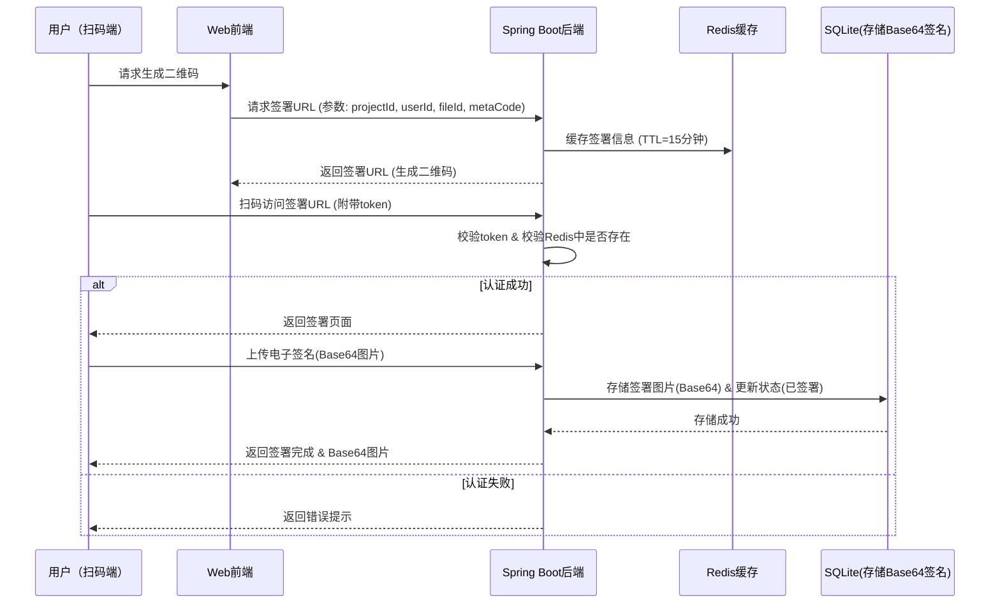

# QR签名系统 - 实现状态

## 🎯 项目概述
基于Spring Boot 3.x的QR码电子签名系统，支持通过扫码方式进行电子签名确认。

## ✅ 已完成功能

### 后端实现
- [x] **Spring Boot项目基础结构** - 完整的MVC架构
- [x] **SignRecord实体类** - 包含所有必需字段和状态枚举
- [x] **SignRecordRepository** - Spring Data JPA数据访问层
- [x] **JwtUtil工具类** - JWT token生成和验证
- [x] **RedisConfig配置类** - Redis缓存配置
- [x] **SignService业务逻辑** - 完整的业务逻辑实现
- [x] **SignController控制器** - RESTful API接口
- [x] **application.yml配置** - SQLite和Redis配置

### 前端实现
- [x] **主页面(index.html)** - 二维码生成和状态监控
- [x] **签名页面(sign.html)** - 签名确认界面
- [x] **JavaScript逻辑(app.js)** - 完整的前端交互逻辑
- [x] **二维码生成** - 使用QRCode.js库
- [x] **手写签名** - Canvas实现签名功能
- [x] **实时状态监控** - 轮询机制

### 核心功能
- [x] **签署URL生成** - POST /api/sign/url
- [x] **Token验证** - GET /api/sign/{token}
- [x] **签名确认** - POST /api/sign/confirm
- [x] **Redis缓存** - 15分钟TTL
- [x] **JWT认证** - 安全的token机制
- [x] **SQLite存储** - 持久化签名记录
- [x] **状态管理** - 未扫描/已扫描未签署/已签署

## 📋 项目结构
```
src/
├── main/
│   ├── java/com/qrsignature/
│   │   ├── QrSignatureApplication.java    # 主应用类
│   │   ├── controller/
│   │   │   └── SignController.java         # 控制器
│   │   ├── service/
│   │   │   └── SignService.java           # 业务逻辑
│   │   ├── repository/
│   │   │   └── SignRecordRepository.java   # 数据访问
│   │   ├── entity/
│   │   │   └── SignRecord.java            # 实体类
│   │   ├── config/
│   │   │   └── RedisConfig.java           # Redis配置
│   │   └── util/
│   │       └── JwtUtil.java               # JWT工具
│   └── resources/
│       ├── application.yml               # 应用配置
│       ├── static/
│       │   ├── index.html                # 主页面
│       │   ├── sign.html                 # 签名页面
│       │   └── app.js                    # 前端逻辑
│       └── templates/
└── qrsignature.db                         # SQLite数据库文件
```

## 🚀 运行指南
1. 确保安装Java 17+和Maven
2. 启动Redis服务
3. 运行：`mvn spring-boot:run`
4. 访问：http://localhost:8080

## 🔧 技术栈
- **后端**: Spring Boot 3.x, Spring Data JPA, SQLite, Redis, JWT
- **前端**: HTML5, CSS3, JavaScript, Canvas API
- **库**: QRCode.js, io.jsonwebtoken

## 📋 API文档
### 1. 生成签署URL
```http
POST /api/sign/url
Content-Type: application/json

{
  "projectId": "project-001",
  "userId": "user-001",
  "fileId": "file-001",
  "metaCode": "META-CODE-001"
}
```

### 2. 验证Token
```http
GET /api/sign/{token}
```

### 3. 确认签名
```http
POST /api/sign/confirm
Content-Type: application/json

{
  "token": "jwt-token",
  "signatureBase64": "base64-encoded-image"
}
```

## 🔄 系统架构



---
