# QR签名系统 - 实现状态

## 🎯 项目概述
基于Spring Boot 3.x的QR码电子签名系统，支持通过扫码方式进行电子签名确认，具备多次签署、签名重用、删除重传等高级功能。

## ✅ 已完成功能

### 后端实现
- [x] **Spring Boot项目基础结构** - 完整的MVC架构
- [x] **SignRecord实体类** - 包含所有必需字段和状态枚举
- [x] **SignRecordRepository** - Spring Data JPA数据访问层
- [x] **JwtUtil工具类** - JWT token生成和验证
- [x] **RedisConfig配置类** - Redis缓存配置
- [x] **SignService业务逻辑** - 完整的业务逻辑实现
- [x] **SignController控制器** - RESTful API接口
- [x] **PageController静态页面路由** - 静态页面访问控制
- [x] **DTO/VO类** - 类型安全的请求响应对象
- [x] **OAuth 2.0 Bearer Token认证** - 标准认证机制
- [x] **application.yml配置** - SQLite和Redis配置

### 前端实现
- [x] **主页面(index.html)** - 签署页面生成和状态监控
- [x] **签名页面(sign.html)** - 签名确认界面
- [x] **JavaScript逻辑(app.js)** - 完整的前端交互逻辑
- [x] **手写签名** - Canvas实现签名功能
- [x] **实时状态监控** - 轮询机制
- [x] **页面重置功能** - 完成后重置到初始状态

### 核心功能
- [x] **签署URL生成** - POST /api/sign/url
- [x] **签名确认** - POST /api/sign/confirm
- [x] **状态检查** - GET /api/sign/status
- [x] **获取历史签名** - GET /api/sign/history/{userId}
- [x] **删除签名记录** - DELETE /api/sign/{signRecordId}
- [x] **Redis缓存** - 15分钟TTL
- [x] **JWT认证** - 安全的token机制
- [x] **SQLite存储** - 持久化签名记录
- [x] **状态管理** - 未扫描/已扫描未签署/已签署
- [x] **多次签署支持** - 同一用户项目文件支持多次签署
- [x] **签名重用** - 支持用户选择历史签名
- [x] **删除重传** - 支持删除签名记录并重新上传

## 📋 项目结构
```
src/
├── main/
│   ├── java/com/qrsignature/
│   │   ├── QrSignatureApplication.java    # 主应用类
│   │   ├── controller/
│   │   │   ├── SignController.java         # 签名控制器
│   │   │   └── PageController.java         # 静态页面控制器
│   │   ├── service/
│   │   │   └── SignService.java           # 业务逻辑
│   │   ├── repository/
│   │   │   ├── SignRecordRepository.java   # 签署记录数据访问
│   │   │   └── UserSignatureRepository.java # 用户签名数据访问
│   │   ├── entity/
│   │   │   ├── SignRecord.java            # 签署记录实体
│   │   │   └── UserSignature.java         # 用户签名实体
│   │   ├── vo/
│   │   │   ├── SignUrlResponse.java       # 签署URL响应
│   │   │   ├── SignStatusResponse.java    # 状态查询响应
│   │   │   └── SignConfirmResponse.java   # 签名确认响应
│   │   ├── dto/
│   │   │   ├── SignUrlRequest.java        # 签署URL请求
│   │   │   ├── SignStatusRequest.java     # 状态查询请求
│   │   │   └── SignConfirmRequest.java    # 签名确认请求
│   │   ├── config/
│   │   │   └── RedisConfig.java           # Redis配置
│   │   └── util/
│   │       ├── JwtUtil.java               # JWT工具
│   │       └── JacksonUtils.java         # JSON工具
│   └── resources/
│       ├── application.yml               # 应用配置
│       ├── static/
│       │   ├── index.html                # 主页面
│       │   ├── sign.html                 # 签名页面
│       │   └── app.js                    # 前端逻辑
│       └── templates/
└── qrsignature.db                         # SQLite数据库文件
```

## 🚀 运行指南
1. 确保安装Java 17+和Maven
2. 启动Redis服务
3. 运行：`mvn spring-boot:run`
4. 访问：http://localhost:8080

## 🔧 技术栈
- **后端**: Spring Boot 3.x, Spring Data JPA, SQLite, Redis, JWT
- **前端**: HTML5, CSS3, JavaScript, Canvas API
- **库**: QRCode.js, io.jsonwebtoken

## 📋 API文档
### 1. 生成签署URL
```http
POST /api/sign/url
Content-Type: application/json

{
  "projectId": "project-001",
  "userId": "user-001",
  "fileId": "file-001",
  "metaCode": "META-CODE-001"
}
```

### 2. 检查签名状态
```http
GET /api/sign/status?projectId=project-001&userId=user-001&fileId=file-001
Authorization: Bearer <token>
```

### 3. 确认签名
```http
POST /api/sign/confirm
Content-Type: application/json
Authorization: Bearer <token>

{
  "signatureBase64": "base64-encoded-image",
  "saveForReuse": true
}
```

### 4. 获取用户历史签名
```http
GET /api/sign/history?userId=user-001
```

### 5. 获取用户签名列表
```http
GET /api/sign/user-signatures?userId=user-001
```

### 6. 删除签名记录
```http
POST /api/sign/delete-record
Content-Type: application/x-www-form-urlencoded

signRecordId=record-id-123
```

### 7. 删除用户签名
```http
POST /api/sign/delete-user-signature
Content-Type: application/x-www-form-urlencoded

userId=user-001&signatureId=signature-id-123
```

### 8. 获取签名图片
```http
GET /api/sign/signature-image?signRecordId=record-id-123
```

## 🔄 系统架构

```mermaid
sequenceDiagram
    participant User as 用户（扫码端）
    participant Web as Web前端
    participant SpringBoot as Spring Boot后端
    participant Redis as Redis缓存
    participant DB as SQLite(存储Base64签名)

    User->>Web: 请求生成二维码
    Web->>SpringBoot: 请求签署URL (参数: projectId, userId, fileId, metaCode)
    SpringBoot->>Redis: 缓存签署信息 (TTL=15分钟)
    SpringBoot-->>Web: 返回签署URL (生成二维码)

    User->>SpringBoot: 扫码访问签署URL (附带token)
    SpringBoot->>SpringBoot: 校验token & 校验Redis中是否存在
    alt 认证成功
        SpringBoot-->>User: 返回签署页面
        User->>SpringBoot: 上传电子签名(Base64图片)
        SpringBoot->>DB: 存储签署图片(Base64) & 更新状态(已签署)
        DB-->>SpringBoot: 存储成功
        SpringBoot-->>User: 返回签署完成 & Base64图片
    else 认证失败
        SpringBoot-->>User: 返回错误提示
    end
```



---
